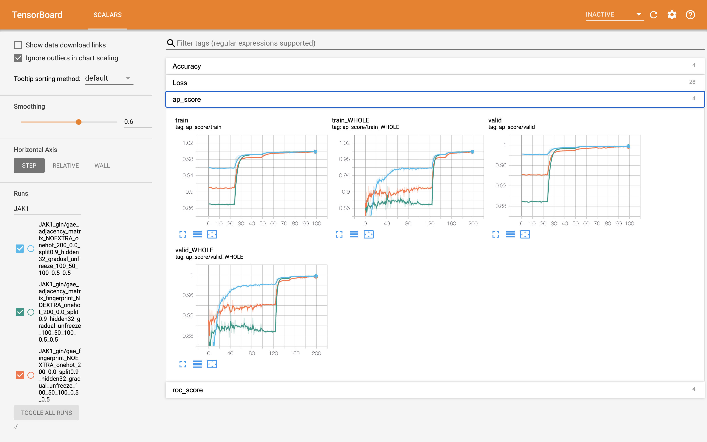
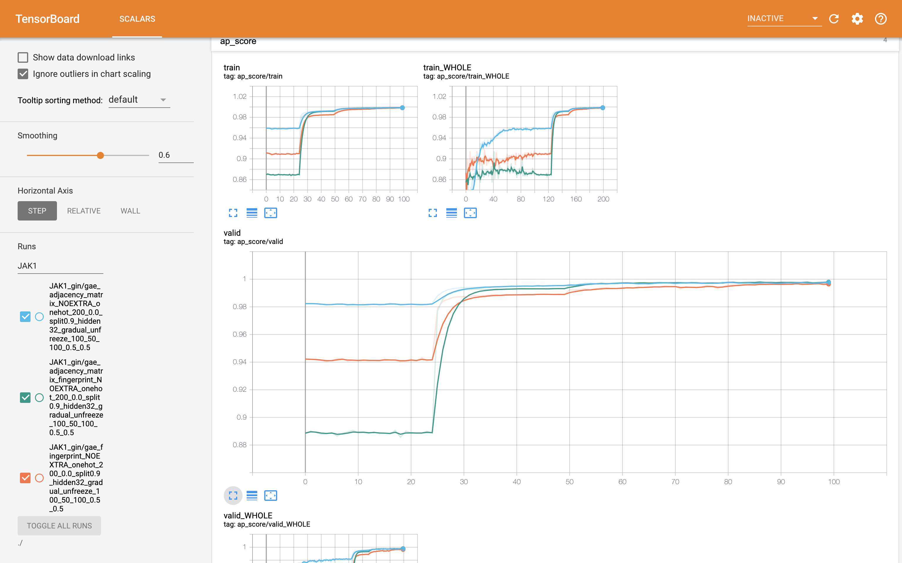

# How to use tensorboard. 
## How to get ready   
Download tensorflow to your computer

## How to run tensorboard. 
command:  
```
tensorboard --logdir=./ --port=6605
```
If everything is good, you will see some outputs like this. 
```
TensorBoard 1.14.0 at http://jimmys-MacBook-Pro.local:6605/ (Press CTRL+C to quit)
```

For mac, go to the webbroswer and type the following command:
```
http://127.0.0.1:6605/
```

## What you can see?
You can see something like this.


